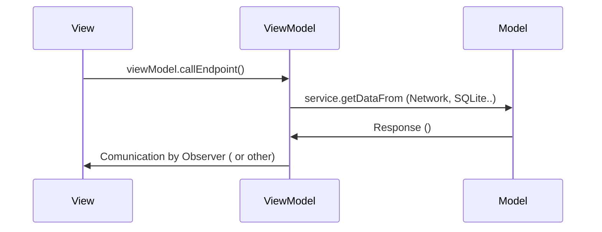

# MVVM


Today! You're going to learn everything you need to become a **Model-View-ViewModel** ninja. 🥷🏽

The first thing to know is: You can adapt this architecture model according to your needs, BUT MVVM has a simple approach. Once you grasp it, you'll be ready to build amazing apps using this architecture pattern.

# Overview



The main goal of MVVM is to provide a clear separation between business logic and the UI layer.  
This concept is illustrated in the sequence diagram above.

In this repository, I showcase the MVVM pattern using an observer and a single network call to demonstrate how each layer works.

I decided **not** to use DI here, so I can create another repository later that covers everything you need to know about dependency injection in Android (coming soon).

Take this opportunity to solidify the crucial concepts of the MVVM architecture in your mind!
.
.

**Structure**: 


**View**: It is responsible for aggregating all UI classes like fragments, activities, bottom sheets, etc. The key point is: your View layer should be free of business logic. This is where you define all visual rules and call your ViewModel whenever you need to fetch some data. 😎

````
view: 
	/ Fragment.kt
	/  Activity.kt
	adapter: 
		   / FragmentAdapter.kt
           / ActivityAdapter.kt
    dialog:  
		   / FragmentDialog.kt
	   ...
````

.
.
___
**Model**: The Model's structure should contain your business logic. Feel free to consider the best patterns to compose your Model layer, but a great suggestion is to use a repository, calling your service interfaces for data fetching or DAO classes for local database queries.

**IMPORTANT**: In real-world projects or production code, the repository is most often provided through dependency injection.

````
Model:
     / ResponseObj.kt
	 / RequestObj.kt 
	 repository: 
			   / Repository.kt
		       / OtherRepository.kt
...
````
  
  .
  .
___
**ViewModel**: To understand the ViewModel's functionality, imagine you're texting your mom.

> You ask her to bring a strangely specific type of cereal from the supermarket while you stay home coding in Java or playing exciting games like _Squad_ or _Arma 3_. 😜

> -   You request your mom to buy a strangely specific cereal.
> -   You wait for her response.
> -   Your mom replies (yes or no).
> -   You then use her response to decide what to do next.

Now, let's think about it in terms of Android software development:

> -   The **View**, which you've already met, sends an application interaction.
> -   This interaction triggers an application request (in this case, a ViewModel call).
> -   The ViewModel handles the request by interacting with the necessary components (repository calls, DAO, maybe SharedPreferences…) — _just like you asking your mom for cereal_.
> -   After receiving the request response, the ViewModel can send that data back using the Observer pattern (e.g., `postValue`).

````
viewModel:
     / ViewModel.kt
...
````

**Important**: Each destination may have a different callback from ViewModel calls. In this example, we’re focusing on network calls, but refer to the docs for other data sources
.
.
***

**Conclusion**:

MVVM is not hard to understand with its simple approach. Improving this model is straightforward when you truly grasp the concept of layer separation. Each layer has a specific behavior, and mixing these rules can lead to serious architectural debts in your application.

Keep in mind that each layer has its own specific behavior, and everything will be okay. **Check out the repository for a practical approach**, and feel free to contribute!

**Coming Soon to this repo (October):** 🚀

-   Tests
-   Room database
-   CRUD
